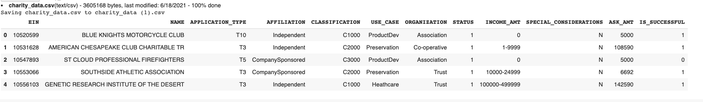
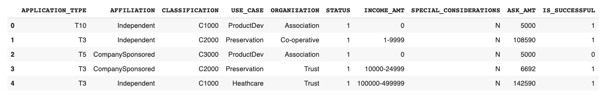
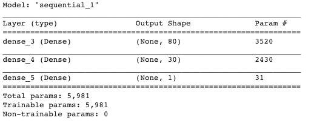
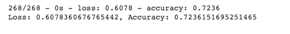
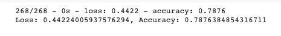
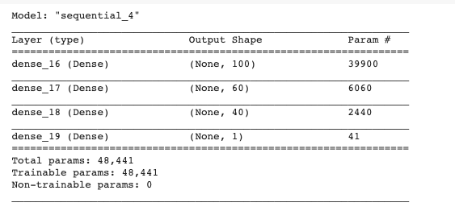
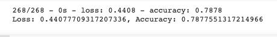

# Neural_Network_Charity_Analysis
Neural networks (also known as artificial neural networks, or ANN) are a set of algorithms that are modeled after the human brain. They are an advanced form of machine learning that recognizes patterns and features in input data and provides a clear quantitative output. In its simplest form, a neural network contains layers of neurons, which perform individual computations. These computations are connected and weighed against one another until the neurons reach the final layer, which returns a numerical result, or an encoded categorical result.

## Project Overview
The purpose of this analysis is to use a neural network to decide which companies should recieve loans from Alphabet Soup Charity Neural Network Analysis. This analysis uses python's TensorFlow library to create, train, and evaluate data gathered from previous loans.

## Tools
Python, Pandas, Matplotlib, Scikit-learn, TensorFlow

## Results

### Data Preprocessing
- The data was imported, analyzed, and cleaned.

- After looking at the data, I established that the target variable is the "IS_SUCCESSFUL" column. I then removed the "EIN" and "NAME" columns as they did not offer any relevant data that could help the model perform better. The remaining columns became the features for the model.

- Further, data was preprocessed (bucketed, encoded and scaled) before fitting into the deep learning model. 

## Compiling, Training, and Evaluating the Model
- For my first attempt at compiling a neuron network consisted of 80 neurons in the first layer and 30 in the second. 
- I removed the "EIN" and "NAME" column.
- Both layers had relu activation functions and the output layer had a sigmoid activation function. 
- I started with these parameters as relu does better with nonlinear data, and two layers allows for a second layer to reweight the inputs from the first layer. 

### Here are the preformance metrics of this model.

- In my second attempt, I removed the "EIN" column as I thought this might have been confusing the model. 
- For my second attempt at compiling a neuron network consisted of 100 neurons in the first layer and 30 in the second and 10 in third. 
- I also lowered the threshold for the classification column so that there were more unique values from that column. 

### Here are the preformance metrics of this model.

- In my third attempt, I reverted back the threshold for the classification column. 
- I also added a third layer with neurons and for my third attempt at compiling a neuron network consisted of 100 neurons in the first layer and 60 in the second and 40 in third.
- By adding a third layer, I wanted to give the model another chance to reweight the inputs from the second layer to the third.
- I also changed the activation function for the three layers to tanh. 
- I did this to see if it would perform better than the relu function. 

### Here are the preformance metrics of this model.

## Summary
After three attempts, I was able to create a model that could preform a 78% accuracy rating. This is potential becasue I got rid of just one columns, I did use the correct activation function and I did have the right amount of layers and neurons. These were the main areas I continued the change with little to improvement after optimizing the data. Next time, I would research more about activation functions to make sure that I am always choosing the right one based on the data.

### Suggestion
- Random forest classifiers can be used to solve this classification problem. 
- The random forest classifier is capable to train on the large dataset and predict values in seconds. 
- It is also capable to achieve comparable predictive accuracy on large tabular data with less code and faster performance.
